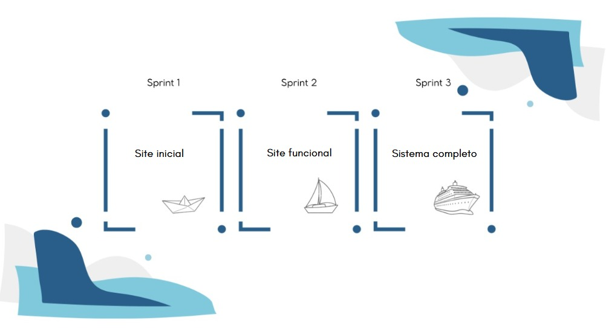

# **SIRAAS**

       
 

 

  |
  <a href="#sobre-o-projeto"> Sobre o Projeto </a> |
  <a href="#-metodologia"> Metodologia </a> |
  <a href="#tecnologia-utilizada"> Tecnologia Utilizada </a> |
  <a href="#mvp"> MVP </a> |
  <a href="#sprints"> Sprints </a> |
  <a href="#backlog-do-produto"> Backlog do Produto </a> |
  <a href="#Equipe"> Equipe </a> |

 

## 📌Sobre o Projeto
> O SIRAAS - Sistema de Registro de Atestados e Avaliação Scrum é resultado do trabalho solicitado pela Faculdade de Tecnologia de São José dos Campos - Professor Jansen Vidal, cujo tema é Sistema web de registro de alunos com atestados médicos e avaliação de equipes ágeis.
> 
> O desafio proposto aos alunos foi a criação de um sistema web que permita o cadastro, consulta e gestão de atestados médicos de alunos, garantindo um registro eficiente e seguro dessas informações, evitando perda de dados e tornando o processo mais ágil. O sistema deve permitir também a avaliação de equipes ágeis em projetos de desenvolvimento de software, avaliando os diferentes papéis dentro da equipe Scrum, como o Scrum Master, Product Owner e Time de Desenvolvimento através do método PACER (Produtividade, Autonomia, Colaboração e Entrega de Resultados).
>
> **Status do Projeto: Em andamento⏳**
 

## 📚 Metodologia
> O framework de Metodologia Ágil utilizado no produto foi o Scrum, um método ágil adaptativo, iterativo, flexível e eficaz. Entre as ferramentas utilizadas no Scrum, uma é a divisão do projeto em **Sprints**. Para selecionar quais seriam as entregas das nossas Sprints, primeiro definimos nosso **MVP**, priorizando as tarefas que trariam maior entrega de valor para o cliente. Então, a partir das Tarefas foi construído o **Backlog do Produto**,  o qual foi aprovado pelo cliente e dividido em 3 Backlog de Sprint.

>Dessa forma, com as Tarefas já traçadas, definimos a quantidade de tempo necessário para cada Tarefa, sendo dividido, de maneira mais otimizada, entre os Desenvolvedores do time.

## 🖥Tecnologia Utilizada
> - Visual Studio Code
> - HTML5
> - CSS3
> - Python
> - Flask
> - Figma
> - Canva
> - Adobe Photoshop
> - JavaScript

 

## 🏆**MVP**:

      
 

1. Site inicial: [Vídeo do Site Inicial](https://github.com/user-attachments/assets/3ed5b9aa-6a17-41e7-a4af-1945947f781b)
2. Site funcional: [Vídeo do Site funcional](https://github.com/user-attachments/assets/a8fff5f6-404b-4638-b21d-fb03f4e2b3140)
3. Sistema completo

 

## 📅Sprints

### Sprint - 1️⃣ 🎯 ([Clique aqui](/documents/Sprints/Sprint1)):  Concluída✅

### Sprint - 2️⃣ 🎯 ([Clique aqui](/documents/Sprints/Sprint2)) : Concluída✅

### Sprint - 3️⃣ 🎯 ([Clique aqui](/documents/Sprints/Sprint3))  

 

## 🗂Backlog do Produto

| Rank | User Story | Sprint | Prioridade  | Estimativa de Esforço | Status | Data de Entrega |
|:-------:|:--------------:|:--------:|:---------------:|:-----------------------------:|:--------:|:----------------------:|
| 1  | "Como aluno, como docente e como membro quero ter uma visão geral do site através de um wireframe navegável." | 1      | Alta                | 07h |✅|  30/03            |
| 2  | "Como aluno, quero obter acesso à página home destinada aos alunos para que eu possa fazer upload de meus atestados e gerenciá-los."  | 1      | Alta                | 26h |✅ |  30/03            |    
| 3  | "Como docente, quero obter acesso à página home destinada aos docentes para que eu possa fazer a gestão dos atestados e analisar as estatísticas de afastamento." | 1      | Alta | 25h | ✅ |  30/03            |    
| 4  | "Como membro da equipe ágil, quero obter acesso à página home destinada aos membros para que eu possa avaliar os outros membros, gerenciar os resultados das avaliações, analisar o Burndown Chart que contém o desenvolvimento do projeto e exportar relatórios analíticos sobre o desempenho da equipe."   | 1      | Alta                | 42h |✅|  30/03            |    
| 5  | "Como desenvolvedor, quero criar o protótipo do site utilizando HTML, CSS e Flask."                 | 1      | Alta                | 101h |✅ |  30/03            |    
| 6  | "Como desenvolvedor, quero tornar o gerenciamento de atestados operacionais.."     | 2     | Média               | 12h | ✅ |  27/04            |    
| 7  | "Como desenvolvedor, quero tornar o upload de atestados operacional."      | 2  | Alta             | 40h | ✅ |  27/04            |    
| 8  | "Como desenvolvedor, quero que seja possível gerar relatórios analíticos sobre o desempenho da equipe e o desenvolvimento do projeto." | 2    | Alta                | 40h |✅|  27/04            |    
| 9  | "Como desenvolvedor, quero tornar as estatísticas de atestados operacionais gerando um relatório."    | 3      | Alta                | 30h |✅|  25/05            |    
| 10   | “Como desenvolvedor, quero gerar documentos em PDF e/ou Excel sobre os relatórios, para facilitar a análise externa.”  | 3  | Alta  | 25h |  ✅ |  25/05            |
| 11  | "Como avaliador, quero um sistema de comparação com resultado das avaliações entre as sprints, para uma noção de evolução no processo ágil"      | 3      | Média              | 25h |✅|  25/05            |
| 12  | "Como desenvolvedor, quero tornar o sistema web responsivo para melhor utilização do site em celulares."  | 3      | Alta                 | 80h |✅ |  25/05            |
 

## 👨‍💻**Equipe**
>Nome da equipe: 404 - Not Found

>• Clara Resende - Dev Team
>
>• Fernanda Pereira - Dev Team
>
>• Gabrielle Gonçalves - Product Owner
>
>• Guilherme Rosa - Dev Team
>
>• Gustavo Gomes - Dev Team
>
>• Isaura Batista - Dev Team
>
>• Letícia Furtado - Dev Team
>
>• Raphael Robim - Dev Team
>
>• Wendy Mininel - Scrum Master

 
